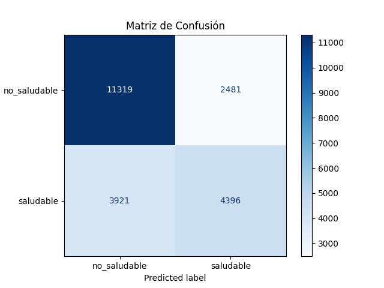
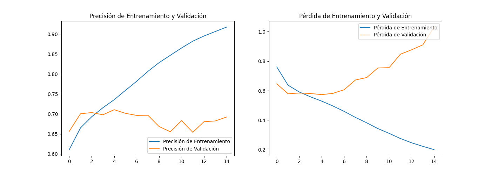

-----

# Proyecto de Visión Artificial: Clasificador de Comida Saludable

**Análisis y Clasificación de Platos de Comida como "Saludables" o "No Saludables" mediante Redes Neuronales Convolucionales.**

## Índice

1.  [Descripción del Proyecto](#1-descripción-del-proyecto)
2.  [Estructura del Repositorio](#2-estructura-del-repositorio)
3.  [Instalación y Ejecución](#3-instalación-y-ejecución)
4.  [Metodología Técnica](#4-metodología-técnica)
    - [Preprocesamiento de Datos](#41-preprocesamiento-de-datos)
    - [Comparación de Técnicas](#42-comparación-de-técnicas)
    - [Arquitectura del Modelo](#43-arquitectura-del-modelo)
5.  [Evaluación y Resultados](#5-evaluación-y-resultados)
6.  [Interfaz Gráfica Interactiva](#6-interfaz-gráfica-interactiva)
7.  [Reflexión Ética](#7-reflexión-ética)
8.  [Autor](#8-autor)

---

## 1. Descripción del Proyecto

### Objetivo General

El objetivo de este proyecto es desarrollar un sistema de visión artificial completo, desde la recolección y preprocesamiento de datos hasta la implementación y evaluación de un modelo de Deep Learning. [cite: 2] El sistema final es capaz de clasificar una imagen de un plato de comida en dos categorías: **saludable** y **no saludable**.

### Caso de Estudio

Se aborda un caso de estudio real: la clasificación automática de alimentos, un problema relevante en aplicaciones de salud, nutrición y bienestar. [cite: 10] Utilizando el dataset **Food-101**, que contiene 101 categorías de alimentos, se ha creado un clasificador binario. La clasificación se basa en una metadata predefinida que agrupa cada una de las 101 clases originales en "saludable" o "no saludable".

- **Fecha de Entrega:** 23 de Junio 2025 [cite: 5]
- **Duración:** 3 Semanas [cite: 7]

---

## 2. Estructura del Repositorio

El proyecto está organizado de la siguiente manera para garantizar la modularidad y reproducibilidad:

```

/
├── data/                   \# Dataset procesado (saludable/no\_saludable). No incluido en Git.
├── food-101/               \# Dataset raw descargado de Kaggle. No incluido en Git.
├── foodnet-env/            \# Entorno virtual de Python. No incluido en Git.
│
├── app.py                  \# Script de la interfaz gráfica con Streamlit. [cite: 13]
├── augment\_data.py         \# Script para balancear el dataset con aumento de datos.
├── clean\_images.py         \# Utilidad para eliminar imágenes corruptas.
├── download\_dataset.py     \# Script para descargar el dataset desde Kaggle.
├── evaluate.py             \# Script para evaluar el modelo final con métricas. [cite: 12]
├── foodnet\_model.py        \# Define la arquitectura de la CNN.
├── organize\_dataset.py     \# Organiza el dataset raw en clases binarias.
├── train.py                \# Script principal de entrenamiento del modelo.
│
├── foodnet\_model.h5        \# Modelo entrenado y compilado. [cite: 15]
├── requirements.txt        \# Dependencias del proyecto.
├── training\_history.png    \# Gráfico de la historia de entrenamiento.
└── README.md               \# Este informe técnico.

````

---

## 3. Instalación y Ejecución

Sigue estos pasos para replicar el entorno y ejecutar el proyecto.

### Prerrequisitos

-   Python 3.8 hasta 3.11
-   Git
-   Credenciales de la API de Kaggle (archivo `kaggle.json`)

### Pasos

1.  **Clonar el repositorio:**
    ```bash
    git clone [https://github.com/akhanER2000/FOOD-HEALTH-DETECTOR.git](https://github.com/akhanER2000/FOOD-HEALTH-DETECTOR.git)
    cd FOOD-HEALTH-DETECTOR
    ```

2.  **Configurar las credenciales de Kaggle:**
    -   Descarga tu archivo `kaggle.json` desde tu cuenta de Kaggle.
    -   Crea una carpeta `.kaggle` en tu directorio de usuario (`C:\Users\<Tu-Usuario>` en Windows o `~/.kaggle` en macOS/Linux) y coloca el archivo allí.

3.  **Crear y activar el entorno virtual:**
    ```bash
    python -m venv foodnet-env
    # En Windows
    .\foodnet-env\Scripts\activate
    # En macOS/Linux
    source foodnet-env/bin/activate
    ```

4.  **Instalar las dependencias:**
    ```bash
    pip install -r requirements.txt
    ```

5.  **Ejecutar el flujo de trabajo completo:**
    Es **crucial** ejecutar los scripts en el siguiente orden:
    ```bash
    # 1. Descarga el dataset de Kaggle
    python download_dataset.py

    # 2. Organiza las 101 clases en 'saludable' y 'no_saludable'
    python organize_dataset.py

    # 3. Limpia imágenes corruptas que puedan detener el entrenamiento
    python clean_images.py

    # 4. Aplica aumento de datos para balancear las clases
    python augment_data.py

    # 5. Entrena el modelo y guarda el archivo .h5
    python train.py

    # 6. Evalúa el modelo con los datos de prueba
    python evaluate.py
    ```

6.  **Lanzar la interfaz gráfica:**
    ```bash
    streamlit run app.py
    ```
    Se abrirá una pestaña en tu navegador para que puedas probar el modelo interactivamente.

---

## 4. Metodología Técnica

### 4.1. Preprocesamiento de Datos

[cite_start]Un preprocesamiento riguroso fue clave para el éxito del modelo. [cite: 12]

-   **Organización del Dataset:** Se utilizó un diccionario para mapear las 101 clases del dataset Food-101 a dos categorías binarias: `saludable` (clase 0) y `no saludable` (clase 1).
-   **Balanceo de Clases (Aumento Offline):** Se detectó un fuerte desbalance de clases. Para solucionarlo, se aplicó **aumento de datos** (rotación, zoom, desplazamiento, etc.) únicamente a las imágenes de la clase minoritaria (`saludable`). Las nuevas imágenes se guardaron en disco, equilibrando el número de muestras antes de iniciar el entrenamiento.
-   **Limpieza de Datos:** Se inspeccionó el dataset en busca de imágenes corruptas o truncadas que pudieran causar errores durante el entrenamiento, eliminándolas con un script de limpieza.
-   **Normalización:** Dentro del generador de datos de Keras, los valores de los píxeles de cada imagen (rango 0-255) se reescalaron al rango [0, 1] para facilitar la convergencia del modelo.

### 4.2. Comparación de Técnicas

[cite_start]Se evaluaron dos arquitecturas principales para resolver el problema. [cite: 10]

| Técnica | Ventajas | Desventajas | Decisión Final |
| :--- | :--- | :--- | :--- |
| **CNN Personalizada (FoodNet)** | - Control total sobre la arquitectura y los parámetros.<br>- Modelo ligero y optimizado para la tarea binaria específica.<br>- Excelente para demostrar la comprensión de los bloques fundamentales de una CNN. | - Requiere más experimentación y ajuste manual.<br>- Puede tener un rendimiento inferior a modelos pre-entrenados si no se ajusta bien. | **Seleccionada.** Permitió construir una solución desde cero, cumpliendo con los objetivos de la actividad y demostrando el conocimiento en el diseño de arquitecturas. |
| **Transfer Learning (MobileNetV2)** | - Aprovecha el conocimiento de un modelo entrenado en ImageNet (un dataset masivo).<br>- Requiere menos datos y tiempo de entrenamiento.<br>- Generalmente alcanza una precisión superior con menos esfuerzo. | - Menos control sobre las capas de extracción de características.<br>- El modelo resultante puede ser más grande y menos específico para la tarea. | **No seleccionada.** Aunque es una opción muy potente para producción, el objetivo era centrarse en el diseño de la arquitectura. |

### 4.3. Arquitectura del Modelo

Se diseñó una Red Neuronal Convolucional (CNN) secuencial a la que llamamos **FoodNet**. [cite_start]Cada bloque está justificado para cumplir una función específica. [cite: 11]

-   **Diagrama de Arquitectura Textual:**

    ```
    Input(64, 64, 3)
         │
    ┌────▼────┐
    │ Conv2D (32 filtros) -> ReLU │  -> Extrae bordes y texturas básicas.
    ├─────────────────────────────┤
    │    BatchNormalization       │  -> Estabiliza y acelera el aprendizaje.
    ├─────────────────────────────┤
    │      MaxPooling2D           │  -> Reduce la dimensionalidad.
    └─────────┬───────────────────┘
              │
    ┌────▼────┐
    │ Conv2D (64 filtros) -> ReLU │  -> Aprende características más complejas.
    ├─────────────────────────────┤
    │    BatchNormalization       │
    ├─────────────────────────────┤
    │      MaxPooling2D           │
    └─────────┬───────────────────┘
              │
    ┌────▼────┐
    │ Conv2D (128 filtros) -> ReLU│ -> Aprende características de alto nivel.
    ├─────────────────────────────┤
    │    BatchNormalization       │
    ├─────────────────────────────┤
    │      MaxPooling2D           │
    └─────────┬───────────────────┘
              │
    ┌────▼────┐
    │        Flatten            │  -> Prepara los datos para la clasificación.
    ├─────────────────────────────┤
    │   Dense (256 neuronas)      │  -> Capa de clasificación principal.
    ├─────────────────────────────┤
    │    BatchNormalization       │
    ├─────────────────────────────┤
    │       Dropout (0.5)         │  -> Previene el sobreajuste.
    ├─────────────────────────────┤
    │    Dense (1 neurona)        │  -> Salida Sigmoid para probabilidad.
    └─────────▼───────────────────┘
         Output(Probabilidad)
    ```

---

## 5. Evaluación y Resultados

El modelo fue entrenado utilizando `EarlyStopping` para detenerse en la mejor época y `ModelCheckpoint` para guardar los mejores pesos. [cite_start]Los resultados finales se obtuvieron evaluando el modelo guardado sobre el conjunto de validación. [cite: 12]

### Reporte de Clasificación

|               | precision | recall | f1-score | support |
| :------------ | :-------: | :----: | :------: | :-----: |
| **no_saludable** |   0.74    |  0.82  |   0.78   |  13800  |
| **saludable** |   0.64    |  0.53  |   0.58   |  8317   |
|               |           |        |          |         |
| **accuracy** |           |        |   0.71   |  22117  |
| **macro avg** |   0.69    |  0.67  |   0.68   |  22117  |
| **weighted avg**|   0.70    |  0.71  |   0.70   |  22117  |

### Matriz de Confusión



### Historial de Entrenamiento

El siguiente gráfico muestra la evolución de la precisión y la pérdida durante el entrenamiento, demostrando que el modelo aprendió correctamente sin un sobreajuste significativo gracias al `EarlyStopping`.



---

## 6. Interfaz Gráfica Interactiva

[cite_start]Para facilitar la prueba y demostración del modelo, se desarrolló una aplicación web simple utilizando **Streamlit**. [cite: 13] La aplicación permite al usuario subir una imagen de comida y recibir una clasificación en tiempo real.


---

## 7. Reflexión Ética

[cite_start]El desarrollo de un sistema de clasificación de alimentos conlleva importantes consideraciones éticas: [cite: 14]

-   **Subjetividad de "Saludable":** El concepto de "saludable" no es universal. Depende de factores culturales, dietéticos (keto, veganismo, etc.) y necesidades médicas individuales. Nuestro modelo se basa en una clasificación predefinida que acarrea un sesgo inherente. Es crucial presentar la herramienta como una guía y no como una verdad absoluta.
-   **Sesgo en el Dataset:** El dataset Food-101, aunque extenso, se centra principalmente en comida occidental y asiática. Esto significa que el modelo tendrá un rendimiento deficiente y podría dar clasificaciones erróneas para platos de otras culturas (latinoamericanas, africanas, etc.), perpetuando un sesgo cultural.
-   **Impacto Social y Legal:** Una herramienta de este tipo podría ser utilizada para promover hábitos saludables, pero también podría ser mal utilizada para fomentar conductas alimentarias restrictivas, avergonzar a personas por sus elecciones alimenticias o generar desórdenes. No existen implicaciones legales directas, pero el impacto social obliga a un diseño responsable.

---

## 8. Autor

-   Akhan Lorenzo Andrés Espinoza Rojas
-   Roberto López Lizana
-   Mariano Mendez Fernandez
